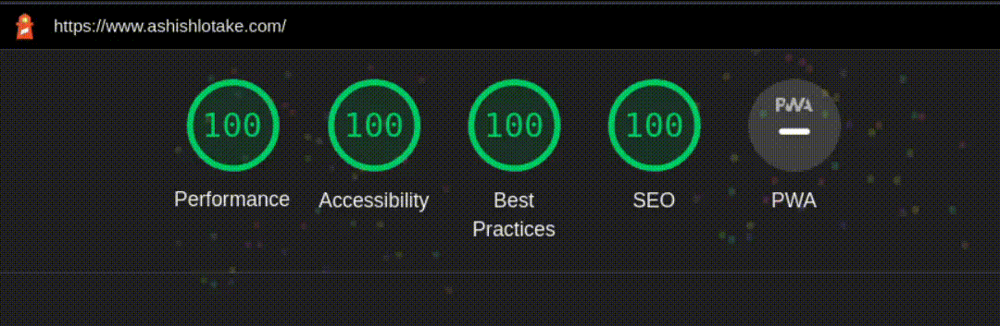

# Personal Blog

This is my portfolio <a href="https://ashishlotake.com/" target="_blank">website</a> built with <a href="https://nextjs.org/" target="_blank">Next.js</a>, <a href="https://tailwindcss.com/" target="_blank">Tailwind CSS</a>  and hosted with <a href="https://www.vercel.com/" target="_blank">Vercel</a>.

## Perfect Light House Score



## 🛠 Installation & Set Up

1. Clone this repository

   ```sh
   git clone https://github.com/ashishlotake/ashishlotake.com.git
   ```

2. Change directories

   ```sh
   cd ashishlotake.com
   ```

3. Install

   ```sh
   npm install
   ```

4. Start the development server

   ```sh
   npm start
   ```


5. Create a .env.local and following the .env.example input some environment variables so that can run normally.

   ```txt
   SPOTIFY_CLIENT_ID =
   SPOTIFY_CLIENT_SECRET =
   SPOTIFY_REFRESH_TOKEN =
   ```


## Source graphics are used

1. [https://undraw.co/search](https://undraw.co/search)
2. [https://freesvgillustration.com/illustrations/](https://freesvgillustration.com/illustrations/)
3. [https://www.manypixels.co/gallery](https://www.manypixels.co/gallery)
4. [Free SVG Vectors](https://bloggingwizard.com/free-vector-illustrations/)

## Feel free to clone and use
